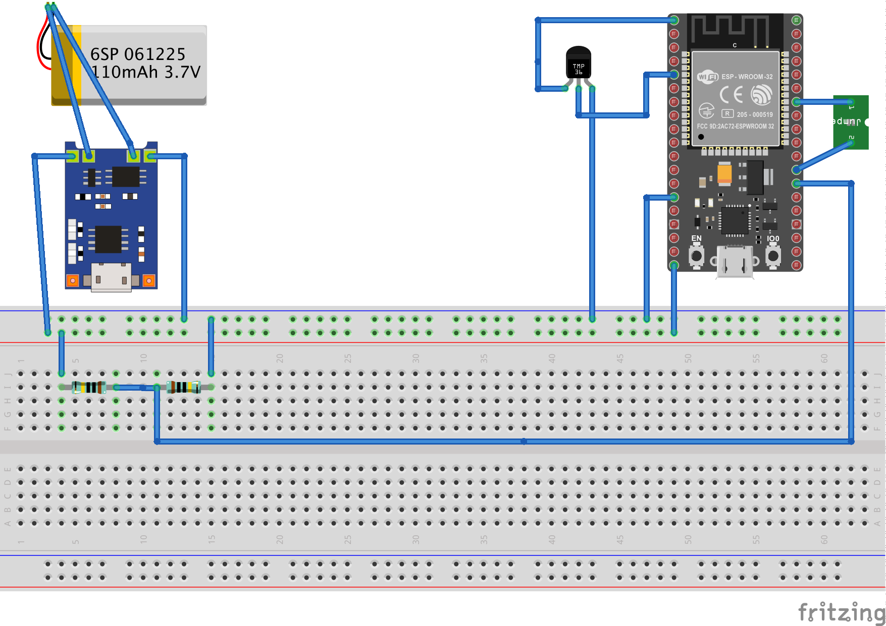

## About
This subproject creates a battery powered wireless sensor via an ESP32 that reports water pressure PSI to an influxdb database.

The basic components:
* ESP32
  * I used: https://smile.amazon.com/gp/product/B08PTRLLDC
* Battery 3.7
  * I used: https://smile.amazon.com/gp/product/B07CXNQ3ZR
* Battery control module (BCM) for LIPO battery to charge and prevent damaging
  * I used: https://smile.amazon.com/gp/product/B071RG4YWM
* Pressure sensor probe
  * I used: https://smile.amazon.com/gp/product/B07N8SX347


## Wiring Diagram


## Build

This project uses PlatformIO, it can be installed on Mac with:
```
brew install platformio
```

Download project dependencies and compile the code with:
```
make
```

Flash the ESP32 with:
```
make upload
```

## Configuration

The wifi username and password are stored in the ESP32 flash storage.  Create the configuration:
```
cp ./data/config.json.sample ./data/config.json
```
Modify the `ssid`, `password`, and `influxdb` properties to point to your local setup then upload all of `./data` to  the ESP32 with:
```
make data
```